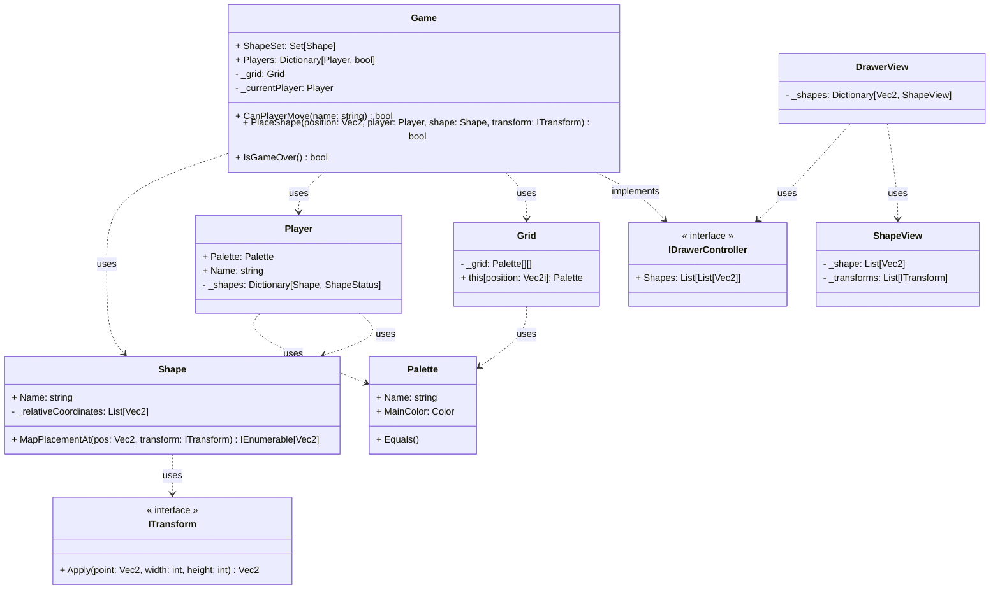

# Distinct Polyomino Blockade

Shield: [![CC BY-NC-SA 4.0][cc-by-nc-sa-shield]][cc-by-nc-sa]

## License

This work is licensed under a
[Creative Commons Attribution-NonCommercial-ShareAlike 4.0 International License][cc-by-nc-sa].

[![CC BY-NC-SA 4.0][cc-by-nc-sa-image]][cc-by-nc-sa]

[cc-by-nc-sa]: http://creativecommons.org/licenses/by-nc-sa/4.0/
[cc-by-nc-sa-image]: https://licensebuttons.net/l/by-nc-sa/4.0/88x31.png
[cc-by-nc-sa-shield]: https://img.shields.io/badge/License-CC%20BY--NC--SA%204.0-lightgrey.svg

## Block
- bool[][] -> true = part of shape
- id/name

- function: (xyposition, transform) -> occupied positions relative to xyposition with transform applied
  01
  11
  (3,3) -> (3,4); (4,4); (4,3)

## BlockStatus enum
- Available
- Used
- Unusable

## Player
- color rgb (readonly)
- name (readonly)
- blocks: map<block -> BlockStatus>

- BlockStatus indexer `[block]`
    get -> status, set status

## Grid
- 2d color array
- null empty

- bool SetColor(position, color)
- GetColor(position) indexer

## Game
- blockset - list of blocks available to players during game
- players: map<player -> bool> (player & can move still)
- grid
- currentPlayer

- bool CanPlayerMove(playername)
- bool PlaceBlock(position, player, block)
- bool IsGameOver()

let players move their pieces around in the dock while they wait

